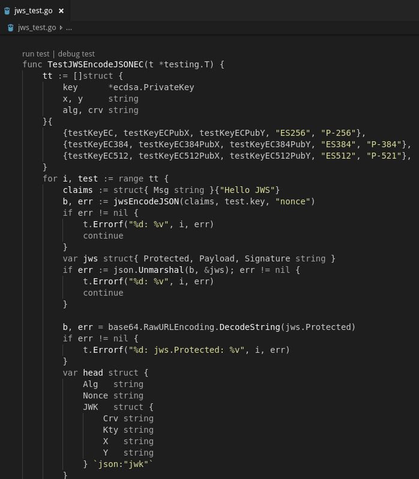
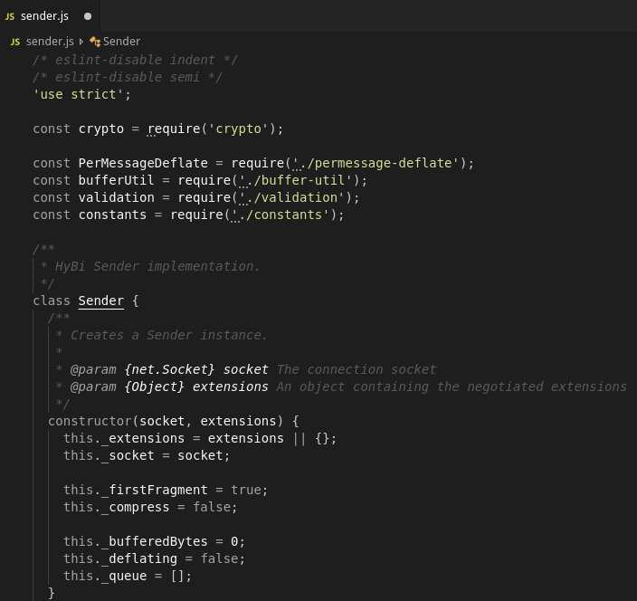

# Dün

A "pretty much greyscale" theme for Visual Studio Code. Strings are dark yellow.

This theme is generated with https://github.com/Tyriar/vscode-theme-generator .

## Screenshots

### Go

### JavaScript

## Credits

Claudio d'Angelis <claudiodangelis@gmail.com>

MIT License (See [LICENSE](LICENSE))

The name of the theme is a tribute to the french progressive rock band [Dün](https://en.wikipedia.org/wiki/D%C3%BCn_(band)).
